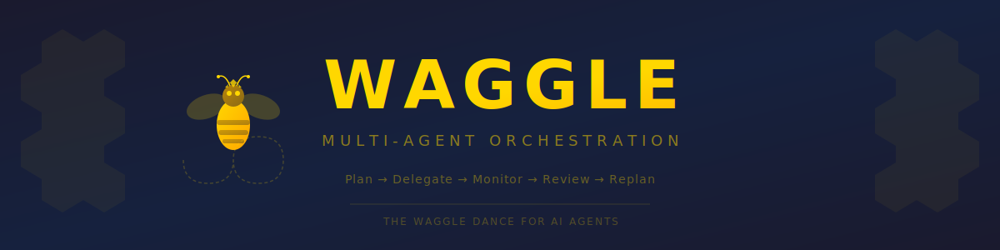

<p align="center">
  
</p>

<p align="center">
  <strong>Multi-agent orchestration through the waggle dance.</strong>
</p>

---

## What is Waggle?

Waggle is a multi-agent orchestration framework written in Go. A central **Queen** agent decomposes complex objectives into a graph of tasks, delegates them to **Worker Bee** sub-agents — AI coding CLIs like Claude Code, Kimi, Gemini, or plain shell commands — monitors execution in parallel, reviews results with LLM judgment, and replans when needed. The entire lifecycle is modeled after the [waggle dance](https://en.wikipedia.org/wiki/Waggle_dance), the figure-eight dance honeybees use to communicate exactly where resources are and how to get them.

## How it Works

The waggle dance has a direct mapping to Waggle's orchestration loop:

| Dance Phase | Waggle Phase | What Happens |
|---|---|---|
| 👑 Scout signals direction | **Plan** | Queen decomposes the objective into a task graph via LLM |
| 🐝 Foragers depart | **Delegate** | Ready tasks are assigned to workers respecting dependencies |
| 🐝 Foragers gather | **Monitor** | Workers execute in parallel; Queen polls for completion |
| 👑 Scout evaluates | **Review** | Queen's LLM evaluates results against requirements |
| 👑 Scout adjusts dance | **Replan** | New tasks are added if gaps are found; the loop continues |

The loop repeats until all tasks are complete, the objective is satisfied, or a maximum iteration limit is reached.

## Architecture

```
┌─────────────────────────────────────────────────────────────────┐
│                       USER OBJECTIVE                            │
│              "Refactor the auth module to use JWT"              │
└──────────────────────────────┬──────────────────────────────────┘
                               │
                    ┌──────────▼──────────┐
                    │     👑 THE QUEEN     │
                    │                     │
                    │  Plan ──► Delegate  │
                    │    ▲          │     │
                    │  Replan    Monitor  │
                    │    ▲          │     │
                    │  Review ◄─────┘     │
                    └───┬─────┬─────┬─────┘
                        │     │     │
              ┌─────────┘     │     └─────────┐
              ▼               ▼               ▼
     ┌──────────────┐ ┌──────────────┐ ┌──────────────┐
     │ 🐝 Worker Bee │ │ 🐝 Worker Bee │ │ 🐝 Worker Bee │
     │  (claude)    │ │   (kimi)     │ │   (exec)     │
     └──────┬───────┘ └──────┬───────┘ └──────┬───────┘
            │                │                │
     ┌──────▼────────────────▼────────────────▼──────┐
     │              🍯 THE HIVE (.hive/)              │
     │        SQLite state · Blackboard · Events      │
     └────────────────────────────────────────────────┘
```

## Quick Start

```bash
# Build
go build -o waggle ./cmd/waggle/

# Initialize a hive in your project
cd /path/to/your/project
waggle init

# Run with an objective (Queen plans + workers execute)
waggle run "Refactor the auth module to use JWT tokens"

# Specify an adapter and worker count
waggle --adapter kimi --workers 8 run "Add unit tests for all handlers"

# Use the exec adapter for raw shell commands (no AI CLI needed)
waggle --adapter exec run "go test ./..."

# Pre-defined tasks from a file
waggle --adapter exec --tasks tasks.json run "Run analysis pipeline"

# Check session status
waggle status

# Resume a previous session
waggle resume <session-id>

# Verbose mode — shows full task results at completion
waggle --adapter exec -v run "ls -la"
```

## Task File Format

Pre-define parallel tasks with dependencies in JSON:

```json
[
  {
    "id": "lint",
    "type": "test",
    "title": "Run linter",
    "description": "golangci-lint run ./...",
    "priority": 2
  },
  {
    "id": "test",
    "type": "test",
    "title": "Run tests",
    "description": "go test -race ./...",
    "priority": 3,
    "depends_on": ["lint"]
  },
  {
    "id": "build",
    "type": "code",
    "title": "Build binary",
    "description": "go build -o waggle ./cmd/waggle/",
    "priority": 1,
    "depends_on": ["test"]
  }
]
```

Tasks respect dependency ordering — `test` won't start until `lint` completes. Independent tasks run in parallel up to the configured worker limit.

## Adapters

Waggle wraps coding agent CLIs behind a uniform interface. The **Task Router** maps task types to adapters.

| Adapter | CLI | Invocation | Notes |
|---|---|---|---|
| `claude-code` | Claude Code | `claude -p "<prompt>"` | Default adapter |
| `kimi` | Kimi Code | `kimi --print --final-message-only -p "<prompt>"` | |
| `gemini` | Gemini CLI | `echo "<prompt>" \| gemini` | Pipe-based |
| `codex` | Codex | `codex exec "<prompt>"` | |
| `opencode` | OpenCode | `opencode run "<prompt>"` | |
| `exec` | Shell | `bash -c "<description>"` | No AI — runs commands directly |

Adapters are configured in `waggle.json` and can be customized with arbitrary commands, args, and environment variables.

## Configuration

Running `waggle init` creates a `waggle.json` configuration file:

```json
{
  "project_dir": ".",
  "hive_dir": ".hive",
  "queen": {
    "model": "claude-sonnet-4-20250514",
    "provider": "anthropic",
    "max_iterations": 50,
    "plan_timeout": 300000000000,
    "review_timeout": 120000000000,
    "compact_after_messages": 100
  },
  "workers": {
    "max_parallel": 4,
    "default_timeout": 600000000000,
    "max_retries": 2,
    "default_adapter": "claude-code"
  },
  "adapters": {
    "claude-code": { "command": "claude", "args": ["-p"] },
    "kimi":        { "command": "kimi",   "args": ["--print", "--final-message-only", "-p"] },
    "gemini":      { "command": "gemini" },
    "codex":       { "command": "codex",  "args": ["exec"] },
    "opencode":    { "command": "opencode", "args": ["run"] },
    "exec":        { "command": "bash" }
  },
  "safety": {
    "allowed_paths": ["."],
    "blocked_commands": ["rm -rf /", "sudo rm"],
    "read_only_mode": false,
    "max_file_size": 10485760
  }
}
```

| Section | Key Fields | Description |
|---|---|---|
| `queen` | `provider`, `model` | The Queen's own LLM for planning, review, and replanning. Providers: `anthropic`, `kimi`, `gemini`, `claude-cli`, `opencode` |
| `queen` | `max_iterations` | Hard cap on the plan-delegate-monitor-review loop |
| `workers` | `max_parallel` | Size of the worker pool (the swarm) |
| `workers` | `default_adapter` | Which adapter to use when the task router has no preference |
| `workers` | `max_retries` | How many times a failed task is retried before giving up |
| `safety` | `allowed_paths` | Directories workers may touch (resolved relative to project root) |
| `safety` | `blocked_commands` | Substring patterns that will be rejected by the safety guard |

## Project Structure

```
waggle/
├── cmd/waggle/              # CLI entry point
│   ├── main.go
│   ├── app.go               #   urfave/cli app definition + flags
│   ├── commands.go           #   init, run, resume, config handlers
│   ├── status.go             #   session / task status display
│   └── tasks.go              #   task file loader
├── internal/
│   ├── queen/               # 👑 The Queen — orchestration loop
│   │   ├── queen.go          #   Plan → Delegate → Monitor → Review
│   │   ├── review.go         #   LLM-backed result evaluation
│   │   └── replan.go         #   LLM-backed replanning
│   ├── worker/              # 🐝 Worker pool manager
│   │   └── worker.go
│   ├── adapter/             # CLI wrapper adapters
│   │   ├── adapter.go        #   Registry + Task Router
│   │   ├── claude.go         #   Claude Code
│   │   ├── kimi.go           #   Kimi Code
│   │   ├── gemini.go         #   Gemini CLI
│   │   ├── codex.go          #   Codex
│   │   ├── opencode.go       #   OpenCode
│   │   └── exec.go           #   Direct shell execution
│   ├── llm/                 # 🧠 Queen's LLM client
│   │   ├── client.go         #   Client interface
│   │   ├── factory.go        #   Provider factory
│   │   ├── anthropic.go      #   Anthropic API client
│   │   └── cli.go            #   CLI-based LLM wrapper
│   ├── task/                # 📌 Task graph with dependency tracking
│   │   └── task.go
│   ├── state/               # 💾 SQLite persistence (WAL mode)
│   │   └── db.go
│   ├── bus/                 # 📨 In-process pub/sub message bus
│   │   └── bus.go
│   ├── blackboard/          # 📋 Shared memory for inter-agent comms
│   │   └── blackboard.go
│   ├── safety/              # 🛡️  Path restriction + command filtering
│   │   └── safety.go
│   ├── config/              # ⚙️  Configuration management
│   │   └── config.go
│   ├── compact/             # 📦 Context window compaction
│   │   └── compact.go
│   └── errors/              # Error classification + retry logic
│       └── errors.go
├── waggle.json              # Configuration file
├── go.mod
└── README.md
```

## The Dance in Detail

### 1. Plan

The Queen receives a user objective and calls her LLM to decompose it into a **task graph** — a directed acyclic graph of typed, prioritized tasks with dependency edges. The graph undergoes **cycle detection** to guarantee it can be topologically sorted. Each task carries:

- **Type** — `code`, `research`, `test`, `review`, or `generic`
- **Priority** — `critical` (3), `high` (2), `normal` (1), `low` (0)
- **Constraints** — scope restrictions that keep the worker focused
- **Allowed paths** — file-level boundaries for safety
- **Dependencies** — IDs of tasks that must complete first

If a `--tasks` file is provided, the planning phase is skipped and the file is loaded directly into the graph.

### 2. Delegate

The Queen queries the task graph for **ready tasks** — those whose dependencies are all satisfied. Ready tasks are assigned to workers from the pool (the swarm), up to `max_parallel` concurrency. The **Task Router** selects the appropriate adapter for each task type, or falls back to the configured default.

### 3. Monitor

Workers execute their assigned tasks as external processes. The Queen polls each worker for status until it reports completion or failure. Workers are ephemeral and stateless — they run a single CLI invocation and return the result. Timeouts are enforced per-task and globally.

### 4. Review

When a task completes, the Queen evaluates the result:

- **Exit-code check** — did the process succeed?
- **LLM review** (if configured) — the Queen's LLM reads the task description and the worker's output, then returns a structured verdict: approved, rejected, or approved with suggestions for follow-up work.

Rejected tasks are retried up to `max_retries` before being marked as failed.

### 5. Replan

After all current tasks are reviewed, the Queen consults her LLM to decide whether the objective has been met or whether additional tasks are needed. New tasks are injected into the graph with proper dependency edges, and the loop returns to **Delegate**. This continues until the objective is satisfied or `max_iterations` is reached.

## Persistence

All state lives in the `.hive/` directory:

```
.hive/
└── hive.db          # SQLite database (WAL mode)
```

The database stores:

- **Sessions** — objective, status, phase, iteration count, timestamps
- **Tasks** — full task state including results, retries, error history
- **Events** — append-only log of every bus message for auditability

SQLite with WAL mode allows concurrent reads while the Queen writes, with a busy timeout of 5 seconds for contention handling. Sessions can be resumed after interruption with `waggle resume <session-id>`.

## Safety

The **Safety Guard** (`internal/safety`) enforces constraints on every worker operation:

- **Path allowlist** — workers can only touch files within configured directories. Paths are resolved to absolute form and checked with prefix matching. By default, only the project root is allowed.
- **Command blocklist** — commands are checked against substring patterns (e.g., `rm -rf /`, `sudo rm`). Any match is rejected before execution.
- **File size limits** — prevents workers from reading or writing files above a configurable threshold (default: 10 MB).
- **Read-only mode** — when enabled, blocks all write operations.

The guard is injected into every adapter invocation, so safety is enforced regardless of which CLI backend is in use.

## License

MIT
